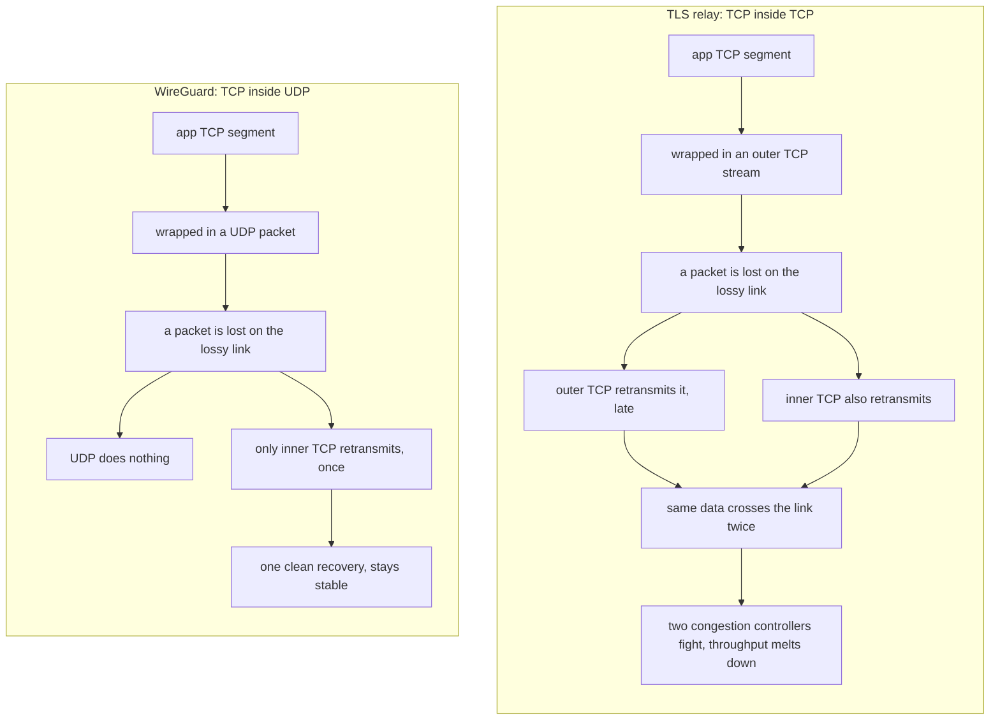

# Decision: WireGuard, not a simpler TLS relay

This documents *why* the VPN is built on WireGuard, and not the simpler thing I
reached for first. It's a record of the reasoning, not just the result.

## The starting point: why not just a TLS relay?

The goal was simple: when I'm on slow, untrusted public WiFi, encrypt **all** my
traffic to a server I control, so no one on that network can snoop or tamper.

The obvious first instinct — and the easiest thing to build — is a **TLS relay**:
open one authenticated TLS connection to my own server (a token so not just anyone
can use it), and push my traffic through it. The server decrypts and forwards to
the internet. A few hours of work, done.

So why did I end up on WireGuard, which is more sophisticated? Three things, in the
order I ran into them — each one a reason the "simple" relay quietly falls apart.

## 1. A TLS relay is TCP inside TCP — and it melts down

A TLS relay is, underneath, a single **TCP** connection. The catch is what it's
carrying: my apps' own connections are *also* TCP. So I'd be running **TCP inside
TCP** — and that breaks in a specific, ugly way.

TCP's whole job is to make an unreliable network reliable: it numbers every byte,
waits for acknowledgements, and retransmits anything that goes missing — treating
loss as "the network is congested, slow down." It assumes it is the *only* thing
doing that. Stack two of them and that assumption is violated:

When the lossy link drops a packet of the **outer** tunnel, the outer TCP
retransmits it — reliably, but *late*. The **inner** TCP, waiting on that data,
can't tell "late" from "lost," so it retransmits **too** — and that copy gets
wrapped in a fresh outer packet and sent again. Now the same data crosses the link
twice, the two congestion controllers each back off thinking they caused the loss,
and under continued loss it spirals: more duplicates, more delay, more timeouts.
Throughput collapses. On cellular and public WiFi — lossy by nature — this isn't
an edge case, it's everyday.

WireGuard sidesteps it by being **UDP**. UDP never retransmits, so a dropped packet
is simply gone — and only the *inner* TCP recovers it, once, exactly as it was
designed to over any normal network. One reliability layer, not two fighting. This
was the first thing that ruled out the relay for *all-traffic* use.

## 2. "Encrypt everything" has to mean *everything*

The second crack: the point of this VPN is to protect **all** my traffic on a
hostile network. But a TLS relay is a TCP *stream* — it can only carry TCP. A huge
slice of modern traffic isn't TCP: **QUIC** (Google, YouTube, most big sites now),
video and voice calls, DNS, games — all **UDP**. Through a TLS relay those either
don't fit at all or get forced to fall back to slower TCP.

WireGuard tunnels **raw IP packets**, so it carries every protocol natively — TCP,
UDP, QUIC, ICMP, whatever. A VPN that silently leaks your UDP traffic isn't really
protecting you, and "redirect *all* of it" was the requirement. The relay can't
meet it; WireGuard meets it by construction.

## 3. A token is a shared secret; WireGuard uses asymmetric keys

The third realization was about keeping the server private. I didn't want to lock
it to an IP allowlist — my IP changes every time I move between networks, and IPs
can be spoofed anyway. So I'd need a **token**: the client proves itself by sending
a secret.

But a token is a *symmetric* secret — the same value lives on both ends and gets
**transmitted** on every connection. That's fragile: it can be logged, stored
insecurely, replayed, or stolen outright if the server is ever compromised. It's
the least sophisticated part of the relay design.

WireGuard authenticates with **asymmetric key pairs** (Curve25519). Each side holds
a **private key that never leaves the device** and shares only its public key. The
handshake (Noise) verifies both peers cryptographically without ever sending a
shared secret — nothing to intercept, nothing to replay, and a compromised server
still can't impersonate me. So the thing I'd have hand-rolled as a weak token is
something WireGuard does *properly*, for free.

## When a TLS relay would actually have been fine

To be fair to the simpler option — a TLS relay is the right tool when:
- you only need to route **one app** or a handful of connections, not the whole system,
- you don't care about UDP/QUIC,
- it's a quick, throwaway thing.

None of those were true here. I wanted **all** traffic, on **lossy** links, with
**solid** auth — exactly the envelope where the relay breaks and WireGuard shines.

## Decision

For an all-traffic personal VPN over lossy networks, WireGuard's **UDP,
packet-level, asymmetric-key** design is the correct one: no TCP-over-TCP meltdown,
carries every protocol, and authenticates with keys that never leave the device.
The TLS relay only *looked* simpler — for this goal it would have been slower,
leakier, and weaker. We use WireGuard.
